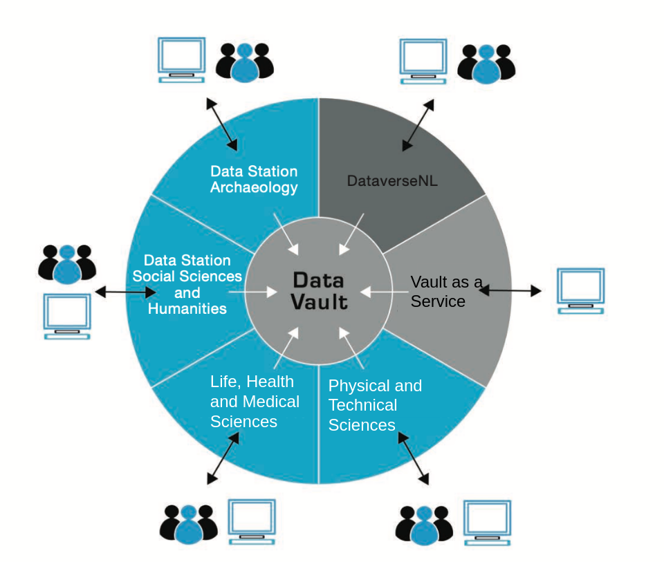

Core Services Overview
======================

!!! note "Migration in progress"

    This documentation describes the future core services of DANS. As of writing, the services are still under

Overview
--------

The DANS Core Services are centered around the concept of a **Data Station**. A Data Station is a repository system that
is used for depositing, storing and disseminating datasets, as well as creating long-term preservation copies of those
datasets. These long-term preservation copies are stored in the DANS Data Vault. The following diagram gives a
high-level overview:

Data Stations
-------------
Each Data Station targets a part of the scientific research community. There is a Data Station for each of:

* [Archaeology]{:target=_blank}
* [Social Sciences & Humanities]{:target=_blank}
* Life, Health & Medical Sciences
* Physical & Technical Sciences

The Data Stations use [Dataverse]{:target=_blank} as their repository system. Dataverse is an open source repository
system developed by Harvard University. The Data Stations create a long-term preservation copy of each dataset in the
DANS Data Vault.

Other services
--------------

The Data Stations will be trusted repositories. They are displayed as blue slices in the diagram. The grey slices are
**not Data Stations**, as they are not in themselves full trusted repositories. In the technical architecture, however,
they are described as variations on the [Data Station architecture](./datastation.md), as they are built using mostly
the same components.

### DataverseNL

[DataverseNL](./dataversenl.md) is a Dataverse installation that offers deposit and dissemination services. Datasets
stored in DataverseNL are also preserved in the DANS Data Vault. However, curation of the datasets is the responsibility
of the DataverseNL customer.

### Vault as a Service

[Vault as a Service](./vaas.md) offers an interface for automated deposit of datasets directly into the DANS Data Vault.
This service can be used as a building block in a customer's own archival workflow.

Interfaces
----------
The services have both human and machine interfaces. This is represented in the diagram by the people and computer
icons. Note that the Vault as a Service has no human interface. See for more information
under [External interfaces](./external-interfaces.md).

[Dataverse]: {{ dataverse_org }}
[Archaeology]: {{ ds_archaeology }}
[Social Sciences & Humanities]: {{ ds_ssh }}
