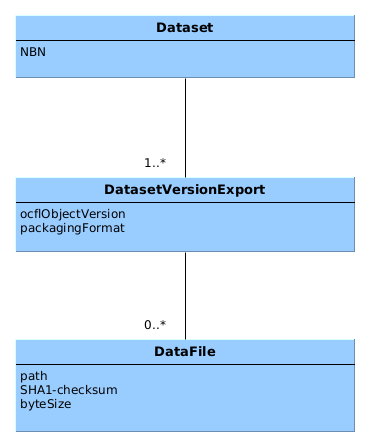

Data Vault Storage Root
=======================

Introduction
------------

The Data Vault is subdivided into **Storage Roots**, each one containing the long term preservation copies for either a Data Station or a "Vault as a
Service"  (VaaS) customer. The Data Vault Storage Root (DVSR) can be viewed as a type of interface, or exchange format, albeit an atypical one, as it is aimed
at
future users, rather than current ones.

!!! alert "dd-data-vault interface"

    Do not confuse the DVSR with the [service interface of dd-data-vault], which is an internal microservice interface that is used by the [transfer service] to 
    store data in the Data Vault.

[service interface of dd-data-vault]: dans-microservices.md#dd-data-vault

[transfer service]: dans-microservices.md#dd-transfer-to-vault

OCFL repositories
-----------------

The DANS Data Vault is implemented as an array of **OCFL** repositories. OCFL stands for [Oxford Common File Layout]{:target=_blank}. It is a community
specification for the layout of a repository that stores versioned digital objects. Each repository, or "storage root," is one
**Data Vault Storage Root (DVSR)**. The Data Stations each have their own DVSR as does each customer of the Vault as a Service.

### Extensions

OCFL can be extended with additional metadata and functionality. The DANS Data Vault uses the following extensions:

* [OCFL Packaging Format extension]{:target=_blank} - This extension defines a way to specify for each version of an object how it is packaged.
* Extension for supporting deletion. **TODO**.

[OCFL Packaging Format extension]: {{ dans_ocfl_extensions }}

Dataset model mapping
---------------------

OCFL is a generic storage model. It does not define the concept of a dataset. The DANS archival systems (Data Stations and Vault as a Service), on the other
hand, are built around the dataset concept. The mapping between the two models is as follows:

| DANS dataset model | OCFL model          |
|--------------------|---------------------|
| Dataset            | OCFL Object         |
| Dataset Version    | OCFL Object Version |
| Datafile           | OCFL Content File   |

### Versions

Each Dataset Version Export (DVE) is stored in a separate OCFL Object Version. This means that there is a 1-to-1 mapping between a DVE and an OCFL Object
Version. Note however, that it is possible that one dataset version is exported multiple times. The mapping of a dataset version to an OCFL Object is therefore
a 1-to-_n_ relationship.

!!! note "A multiple exports scenario"

    A scenario where a dataset version is exported multiple times is when the dataset was updated in the Data Station without creating a new version. This can 
    be done by a superuser and is known as **"updatecurrent"**. A new Dataset Version Export will be created and therefore a new OCFL Object Version will be 
    created as well. The Data Station version history, however, will **not** display an additional version.

### Identifying metadata

To identify datasets, versions and data files in the OCFL repository, the following metadata is used:

{: .align-center}

The full metadata of each dataset version is stored, but the way it is stored depends on the packaging format used. The current packaging format is based on
Dataverse implementation of [RDA BagPack]{:target=_blank}.

[RDA BagPack]: {{ bagpack_specs }}
[bag]: {{ bagit_specs }}
[Oxford Common File Layout]: {{ ocfl_url }}

Serialization in layers
-----------------------

OCFL repositories can be serialized in different ways, for example as a directory structure on a file system, or as objects in an object store. The DANS Data
Vault uses the SURF [Data Archive]{:target=_blank} tape storage. The tape storage system that is used by Data Archive organizes files in a file-folder
structure, so in principle serialization should be the same as to a disk-based files system, from OCFL's perspective. However, the tape storage system requires
a minimum file size of 1GB, which is much larger than the typical data file stored in the DANS Data Vault. To meet this requirement, the OCFL repositories are
stored as a series of DMFTAR archives, each of which is larger than 1GB. Each archive forms a layer. For a more detailed description of the layers, see the
documentation of [dans-layer-store-lib]{:target=_blank}.

To restore the OCFL repository, the layers must be extracted in the correct order. SURF provides a utility called [dmftar]{:target=_blank} to create and extract
DMFTAR archives. This utility is the interface to the tape storage system.

!!! alert "Restoring without the `dmftar` utility"

    Even without the `dmftar` utility, it is possible to restore the OCFL repository, as long as the layers are extracted in the correct order. A DMFTAR archive 
    is just a lightweight wrapper around a TAR archive, implemented as a directory containing batches of (possibly multi-volume) TAR files along with index 
    files and a checksum file.

[dans-layer-store-lib]: dans-libraries.md#dans-layer-store-lib
[Data Archive]: {{ data_archive }}
[dmftar]: {{ dmftar }}
