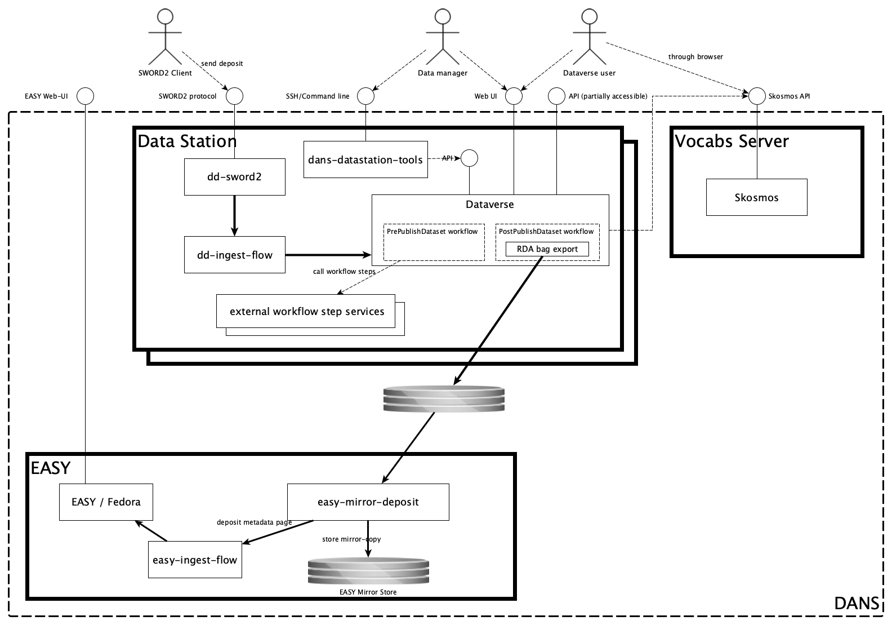

Mirroring to EASY
=================

Until a Data Station obtains the [Core Trust Seal]{:target=_blank} (CTS), it will mirror all deposited dataset to EASY, thus ensuring that these datasets are stored in a
trusted repository. This temporary configuration swaps out the Transfer Server for the EASY server. 

[Core Trust Seal]: https://www.coretrustseal.org/about/