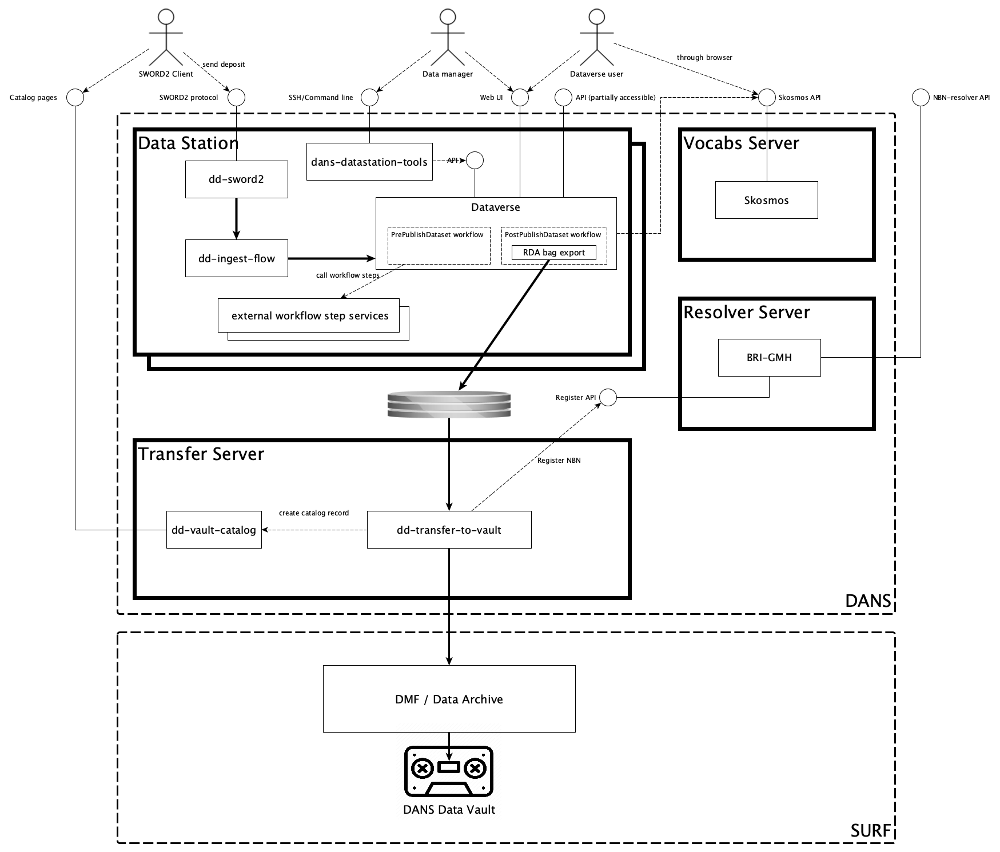
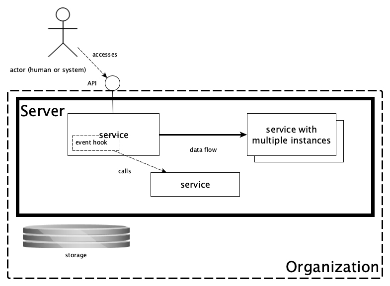

DANS Data Station Architecture
==============================

Overview
--------
This document gives an overview of the DANS Data Station architecture. The schema below displays all the components of a Data Station and how they relate to
each other. The notation used is not a formal one and is intended to be self-explanatory. To the extent that it is not you might want to consult
the [legend that is included at the end of this page](#schema-legend).

Actors
------

* **SWORD2 Client** - a software client that interacts with the [DANS SWORDv2 Service](#dd-sword2) to deposit datasets.
* **Data Station User** - a user of the Data Station, typically a customer who downloads or deposits data.
* **Data Manager** - a user with special privileges, who curates and publishes datasets submitted for review by a user.

Components
----------

### Dataverse

> "The Dataverse Project is an open source web application to share, preserve, cite, explore, and analyze research data."

In the Data Station this repository system is used for depositing, storing and disseminating datasets, as well as creating long-term preservation copies of
those datasets.

#### Workflows

Dataverse provides event hooks that allow to configure workflows to run just before and after a publication event. These workflows can have multiple steps. A
step can be implemented as part of Dataverse or as an external service. The following microservices are configured to run as `PrePublishDataset` workflow steps:

* [dd-vault-metadata](#dd-vault-metadata)

The following microservices are candidates to become part of the `PrePublishDataset` workflow in the future:

* [dd-virus-scan](#dd-virus-scan)
* [dd-verify-dataset](#dd-verify-dataset)

The **RDA Bag Export** flow step is implemented in Dataverse and is used to export an RDA compliant bag (also a "Dataset Version Export" or DVE) for each
dataset version after publication (i.e. in the `PostPublishDataset` workflow). This exported bag is then picked up
by [dd-transfer-to-vault](#dd-transfer-to-vault).

| Docs                        | Code                                                |
|-----------------------------|-----------------------------------------------------|
| [Dataverse]{:target=_blank} | <https://github.com/IQSS/dataverse>{:target=_blank} |
| [Workflows]{:target=_blank} | Part of the Dataverse code base                     |

### dd-sword2

DANS implementation of the SWORD v2 protocol for automated deposits.

| Docs                                      | Code                                                                   |
|-------------------------------------------|------------------------------------------------------------------------|
| [dd-sword2]{:target=_blank}               | <https://github.com/DANS-KNAW/dd-sword2>{:target=_blank}               |
| [dd-dans-sword2-examples]{:target=_blank} | <https://github.com/DANS-KNAW/dd-dans-sword2-examples>{:target=_blank} |

### dd-dataverse-authenticator

A proxy that authenticates clients on behalf of Dataverse, using the basic auth protocol. It is used by [dd-sword2](#dd-sword2) to authenticate its clients by
their Dataverse account credentials.

| Docs                                         | Code                                                                      |
|----------------------------------------------|---------------------------------------------------------------------------|
| [dd-dataverse-authenticator]{:target=_blank} | <https://github.com/DANS-KNAW/dd-dataverse-authenticator>{:target=_blank} |

### dd-ingest-flow

Service for ingesting deposit directories into Dataverse.

| Docs                             | Code                                                          |
|----------------------------------|---------------------------------------------------------------|
| [dd-ingest-flow]{:target=_blank} | <https://github.com/DANS-KNAW/dd-ingest-flow>{:target=_blank} |

### dd-validate-dans-bag

Service that checks whether a bag complies with DANS BagIt Profile v1. It is used by [dd-ingest-flow](#dd-ingest-flow) to validate bags that are uploaded via
SWORD2 or are migrated from EASY.

| Docs                                    | Code                                                                |
|-----------------------------------------|---------------------------------------------------------------------|
| [dd-validate-dans-bag]{:target=_blank}  | <https://github.com/DANS-KNAW/dd-validate-dans-bag>{:target=_blank} |
| [DANS BagIt Profile v1]{:target=_blank} | <https://github.com/DANS-KNAW/dans-bagit-profile>{:target=_blank}   | 
| [DANS schema]{:target=_blank}           | <https://github.com/DANS-KNAW/dans-schema>{:target=_blank}          | 

### dd-manage-deposit

Service that manages and maintains information about deposits in a deposit area.

| Docs                                | Code                                                             |
|-------------------------------------|------------------------------------------------------------------|
| [dd-manage-deposit]{:target=_blank} | <https://github.com/DANS-KNAW/dd-manage-deposit>{:target=_blank} |

### dans-datastation-tools

Command line utilities for Data Station application management.

| Docs                                     | Code                                                                  |
|------------------------------------------|-----------------------------------------------------------------------|
| [dans-datastation-tools]{:target=_blank} | <https://github.com/DANS-KNAW/dans-datastation-tools>{:target=_blank} |

### dd-verify-dataset

Service for performing curation checks on datasets.

| Docs                                | Code                                                             |
|-------------------------------------|------------------------------------------------------------------|
| [dd-verify-dataset]{:target=_blank} | <https://github.com/DANS-KNAW/dd-verify-dataset>{:target=_blank} |

### dd-virus-scan

A service p that scans all files in a dataset for virus using `clamav` and blocks publication if a virus is found.

| Docs                            | Code                                                         |
|---------------------------------|--------------------------------------------------------------|
| [dd-virus-scan]{:target=_blank} | <https://github.com/DANS-KNAW/dd-virus-scan>{:target=_blank} |

### dd-vault-metadata

A service that fills in the "Vault Metadata" for a dataset version. These metadata will be used later on
by [dd-transfer-to-vault](#dd-transfer-to-vault) to catalogue the long-term preservation copy of the dataset version when it is stored on tape.

| Docs                                | Code                                                             |
|-------------------------------------|------------------------------------------------------------------|
| [dd-vault-metadata]{:target=_blank} | <https://github.com/DANS-KNAW/dd-vault-metadata>{:target=_blank} |

### Skosmos

A thesaurus service developed by the National Library of Finland. It is used to serve the external controlled vocabulary fields.

| Docs                      | Code                                                  |
|---------------------------|-------------------------------------------------------|
| [Skosmos]{:target=_blank} | <https://github.com/NatLibFi/Skosmos>{:target=_blank} |

### dd-transfer-to-vault

Service for preparing Dataset Version Exports for storage in the [DANS Data Vault](#dans-data-vault). This includes validation, aggregation into larger files
and creating a [vault catalog](#dd-vault-catalog) entry for each export.

| Docs                                   | Code                                                                |
|----------------------------------------|---------------------------------------------------------------------|
| [dd-transfer-to-vault]{:target=_blank} | <https://github.com/DANS-KNAW/dd-transfer-to-vault>{:target=_blank} |

### dd-vault-catalog

Service that manages a catalog of all Dataset Version Exports in the [DANS Data Vault](#dans-data-vault). It will expose a summary page for each stored dataset.

| Docs                               | Code                                                            |
|------------------------------------|-----------------------------------------------------------------|
| [dd-vault-catalog]{:target=_blank} | <https://github.com/DANS-KNAW/dd-vault-catalog>{:target=_blank} |

### BRI-GMH

The NBN resolver service operated by DANS in cooperation with the Koninklijke Bibliotheek. It resolves NBN persistent identifiers to their current location.
The resolver is hosted at <https://persistent-identifier.nl/>.

| Docs and code                                                           |
|-------------------------------------------------------------------------|
| [NBN]{:target=_blank}                                                   |
| <https://github.com/DANS-KNAW/gmh-registration-service>{:target=_blank} |
| <https://github.com/DANS-KNAW/gmh-resolver-ui>{:target=_blank}          |
| <https://github.com/DANS-KNAW/gmh-meresco>{:target=_blank}              | 

### DANS Data Vault

The DANS long-term preservation archive. This is implemented as a collection of files stored on tape via SURF's Data Archive service. The Dataset Version
Exports are wrapped in an [OCFL]{:target=_blank} repository structure.

| Docs                                |
|-------------------------------------|
| [SURF Data Archive]{:target=_blank} |
| [OCFL]{:target=_blank}              |

Libraries
---------

The components mentioned above use many open source libraries. A couple of these are developed by DANS and are available on GitHub.

| Library                                     | Code                                                                     |
|---------------------------------------------|--------------------------------------------------------------------------|
| [dans-bagit-lib]{:target=_blank}            | <https://github.com/DANS-KNAW/dans-bagit-lib>{:target=_blank}            |    
| [dans-dataverse-client-lib]{:target=_blank} | <https://github.com/DANS-KNAW/dans-dataverse-client-lib>{:target=_blank} |
| [dans-java-utils]{:target=_blank}           | <https://github.com/DANS-KNAW/dans-java-utils>{:target=_blank}           |

[dans-bagit-lib]: https://dans-knaw.github.io/dans-bagit-lib

[dans-dataverse-client-lib]: https://dans-knaw.github.io/dans-dataverse-client-lib

[dans-java-utils]: https://dans-knaw.github.io/dans-java-utils

[Dataverse]: https://guides.dataverse.org/en/latest/user/index.html

[Workflows]: https://guides.dataverse.org/en/latest/developers/workflows.html#workflows

[dd-sword2]: https://dans-knaw.github.io/dd-sword2/

[dd-dataverse-authenticator]: https://dans-knaw.github.io/dd-dataverse-authenticator/

[dd-ingest-flow]: https://dans-knaw.github.io/dd-ingest-flow

[dd-validate-dans-bag]: https://dans-knaw.github.io/dd-validate-dans-bag

[dd-manage-deposit]: https://dans-knaw.github.io/dd-manage-deposit

[DANS BagIt Profile v1]: {{ dans_bagit_profile }}

[DANS schema]: https://dans-knaw.github.io/dans-schema/

[dans-datastation-tools]: https://dans-knaw.github.io/dans-datastation-tools

[dd-verify-dataset]: https://dans-knaw.github.io/dd-verify-dataset

[http/authext]: https://guides.dataverse.org/en/latest/developers/workflows.html#http-authext

[dd-virus-scan]: https://dans-knaw.github.io/dd-virus-scan

[dd-vault-metadata]: https://dans-knaw.github.io/dd-vault-metadata

[dd-vault-catalog]:  https://dans-knaw.github.io/dd-vault-catalog

[dd-transfer-to-vault]:  https://dans-knaw.github.io/dd-transfer-to-vault

[Skosmos]: {{ skosmos_url }}

[SURF Data Archive]: https://servicedesk.surf.nl/wiki/display/WIKI/Data+Archive

[OCFL]: https://ocfl.io/

[NBN]: https://www.ifla.org/references/best-practice-for-national-bibliographic-agencies-in-a-digital-age/resource-description-and-standards/identifiers/national-bibliography-number-nbn/

Schema Legend
-------------
{width=50%}

