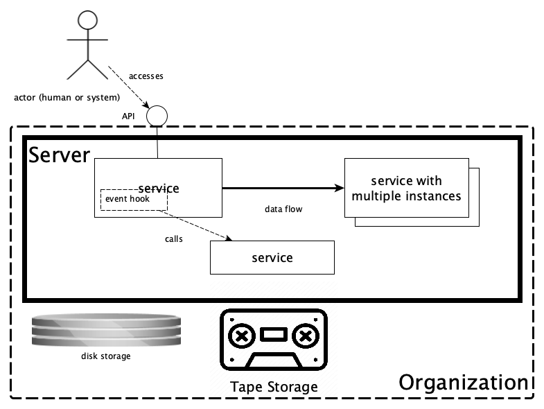

DANS Data Station Architecture
==============================

Overview
--------
This document gives an overview of the DANS Data Station architecture. The schema below displays all the components of a Data Station and how they relate to
each other. The notation used is not a formal one and is intended to be self-explanatory. To the extent that it is not you might want to consult
the [legend that is included at the end of this page](#schema-legend).

Components
----------

### Dataverse

> "The Dataverse Project is an open source web application to share, preserve, cite, explore, and analyze research data."

In the Data Station this repository system is used for depositing, storing and disseminating datasets, as well as creating long-term preservation copies of
those datasets.

| Docs                         | Code                                                |
|------------------------------|-----------------------------------------------------|
| [Dataverse]{:target=_blank}  | <https://github.com/IQSS/dataverse>{:target=_blank} |
| [Workflows]{:target=_blank}  | Part of the Dataverse code base                     |

### dd-sword2

DANS implementation of the SWORD v2 protocol for automated deposits.

| Docs                        | Code                                                     |
|-----------------------------|----------------------------------------------------------|
| [dd-sword2]{:target=_blank} | <https://github.com/DANS-KNAW/dd-sword2>{:target=_blank} |

### dd-ingest-flow

Service for ingesting deposit directories into Dataverse.

| Docs                             | Code                                                          |
|----------------------------------|---------------------------------------------------------------|
| [dd-ingest-flow]{:target=_blank} | <https://github.com/DANS-KNAW/dd-ingest-flow>{:target=_blank} |

### dans-datastation-tools

Command line utilities for Data Station application management.

| Docs                                     | Code                                                                  |
|------------------------------------------|-----------------------------------------------------------------------|
| [dans-datastation-tools]{:target=_blank} | <https://github.com/DANS-KNAW/dans-datastation-tools>{:target=_blank} |

### External Workflow Step Services

Dataverse provides event hooks that allow to configure workflows to run just before and after a publication event. These workflows can have multiple steps. The
step-type [http/authext]{:target=_blank} will invoke an external HTTP service and authorize it to query and modify the dataset being published. The following
micro-services have been created to perform specific steps

#### dd-workflow-step-virus-scan

A (`PrePublishDataset`) workflow step that scans all files in a dataset for virus using `clamav` and blocks publication if a virus is found.

| Docs                                            | Code                                                                       |
|-------------------------------------------------|----------------------------------------------------------------------------|
| [dd-workflow-step-virus-scan]{:target=_blank}   | <https://github.com/DANS-KNAW/dd-workflow-step-virus-scan>{:target=_blank} |

#### dd-workflow-step-vault-metadata

A (`PrePublishDataset`) workflow step that fills in the "Vault Metadata" for a dataset version. These metadata will be used later on
by [dd-transfer-to-vault](#dd-transfer-to-vault) to catalogue the long-term preservation copy of the dataset version when it is stored on tape.

| Docs                                              | Code                                                                       |
|---------------------------------------------------|----------------------------------------------------------------------------|
| [dd-workflow-step-vault-metadata]{:target=_blank} | <https://github.com/DANS-KNAW/dd-workflow-step-vault-metadata>{:target=_blank} |

### Skosmos

A thesaurus service developed by the National Library of Finland. It is used to serve the external controlled vocabulary fields.

| Docs                      | Code                                                   |
|---------------------------|--------------------------------------------------------|
| [Skosmos]{:target=_blank} | <https://github.com/NatLibFi/Skosmos>{:target=_blank}  |

### dd-transfer-to-vault

Service

### dd-vault-catalog

### BRI-GMH

### SURF Data Archive

[Dataverse]: https://guides.dataverse.org/en/latest/user/index.html

[Workflows]: https://guides.dataverse.org/en/latest/developers/workflows.html#workflows

[dd-sword2]: https://dans-knaw.github.io/dd-sword2/

[dd-ingest-flow]: https://dans-knaw.github.io/dd-ingest-flow

[dans-datastation-tools]: https://dans-knaw.github.io/dans-datastation-tools

[http/authext]: https://guides.dataverse.org/en/latest/developers/workflows.html#http-authext

[dd-workflow-step-virus-scan]: https://dans-knaw.github.io/dd-workflow-step-virus-scan

[dd-workflow-step-vault-metadata]: https://dans-knaw.github.io/dd-workflow-step-vault-metadata

[Skosmos]: https://www.skosmos.org/

Schema Legend
-------------
{width=50%}

