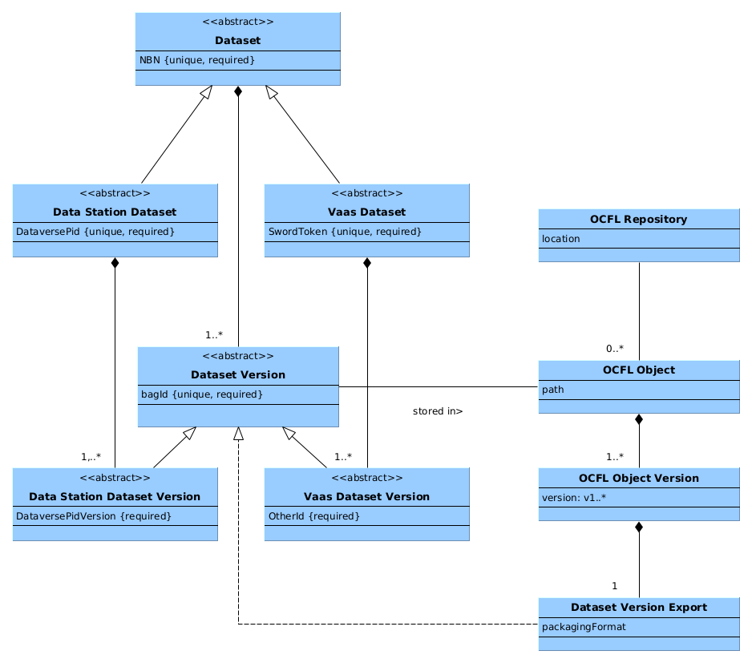

OCFL repository
===============

The DANS Data Vault is implemented as a collections of [OCFL]{:target=_blank} Storage Roots. OCFL stands for Oxford Common File
Layout. It is a community specification for the layout of a repository that stores digital objects.

Mapping of conceptual dataset model to OCFL objects
---------------------------------------------------

The diagram below details how the Data Vault stores the datasets in the OCFL repository. Datasets are conceived as a collection of
Dataset Versions. Dataset versions are exported to Dataset Version Exports (DVEs). Currently, this is done as an RDA compliant
bag. In the future other packaging formats may be supported.

{:width="75%"}

Since every Dataset Version is stored in a separated OCFL object, multiple DVEs can be stored for the same Dataset Version. This
is necessary to support the following scenarios:

* Replacing a version that was updated in place, i.e. with "updatecurrent" in Dataverse.
* Repackaging dataset versions in a different packaging format.

[OCFL]: {{ ocfl_url }}

Layout of a repository
----------------------

An OCFL repository consists of a Storage Root and objects stored hierarchically under that Root. Although the hierarchy in
question does not have to reside on a hierarchical file system, it is conceptually represented as a file/folder tree.

The picture below shows an example of a complete valid OCFL Storage Root, containing one object with two versions.

```plaintext
example-ocfl-storage-root
├── 0004-hashed-n-tuple-storage-layout.md
├── 0=ocfl_1.1
├── ocfl_1.1.md
├── ocfl_layout.json
├── 866
│   └── 456
│       └── e5a
│           └── 866456e5a267286c35b3a697b4a4ecf42ff34a3060699ce4dc88da9b58862341
│               ├── 0=ocfl_object_1.1
│               ├── inventory.json
│               ├── inventory.json.sha512
│               ├── v1
│               │   ├── content
│               │   │   └── test
│               │   │       └── path
│               │   │           └── packaged-dataset-version.zip
│               │   ├── inventory.json
│               │   └── inventory.json.sha512
│               └── v2
│                   ├── content
│                   │   └── test
│                   │       └── path
│                   │           └── repackaged-dataset-version.zip
│                   ├── inventory.json
│                   └── inventory.json.sha512
└── extensions
    └── 0004-hashed-n-tuple-storage-layout
        └── config.json
```

Packaging an OCFL Storage Root in immutable TAR files
-----------------------------------------------------

### Aggregating OCFL objects into a TAR file

The tape storage facility used to implement the DANS Data Vault requires the stored files to be on average 1G or larger. Since the
typical dataset versions stored by DANS are much smaller, a number of OCFL Objects is first collected and packaged together as a
TAR file containing an OCFL Storage Root. This Storage Root will be valid if each OCFL Object contains a continuous range of
version starting with version 1.

```<picture of TAR entries>```

### Storing new OCFL Object versions

As long as OCFL objects for a TAR file are still being collected, new versions for existing objects can be added without breaking
the validity of the OCFL Storage Root. What happens if a new version for an OCFL Object is created, when that object is already
part of a TAR file on tape?

The answer is that instead of a complete Object an *Object Layer* will be included in the currently open OCFL Storage Root. This
means that&mdash;in turn&mdash;the open OCFL Storage Root will no longer be valid and is merely an OCFL Storage Root Layer.

```<picture of TAR entries>```

The TAR files on tape therefore contain a mix of OCFL Storage Root Layers and OCFL Storage Roots. The OCFL Storage Roots can be
conceived as a special case of OCFL Storage Root Layers, namely those that contain OCFL Objects with a continuous range of
versions starting with version 1. In general, we can therefore say that the TAR files on tape contain OCFL Storage Root Layers.

### Restoring an OCFL Storage Root from tape


 