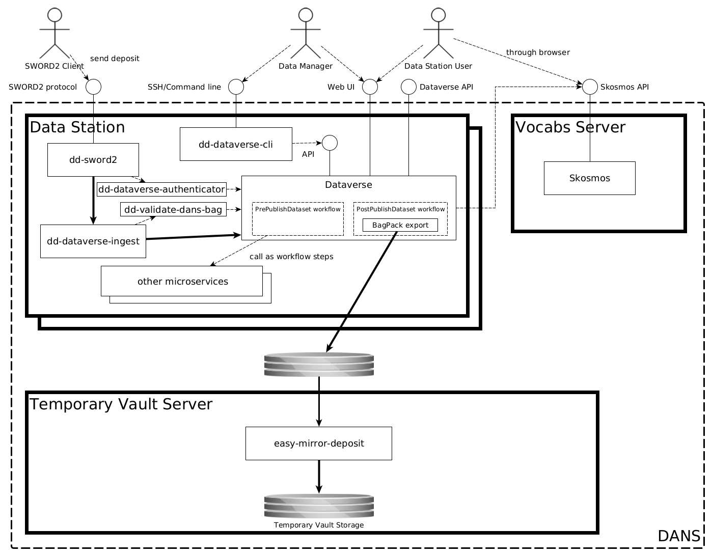

Temporary Vault Configuration
==============================

The DANS Data Vault is currently still in development. In the meantime, long term preservation is supported by storage of RDA bags in a Temporary Vault. The
packaging of the dataset versions is therefore the same as for the DANS Data Vault, but the storage location is different and does not yet have an OCFL
structure.

[<button class="btn">Enlarge Image</button>](arch-overview-temp-vault.png){: data-lightbox="group" data-title="Overview" }