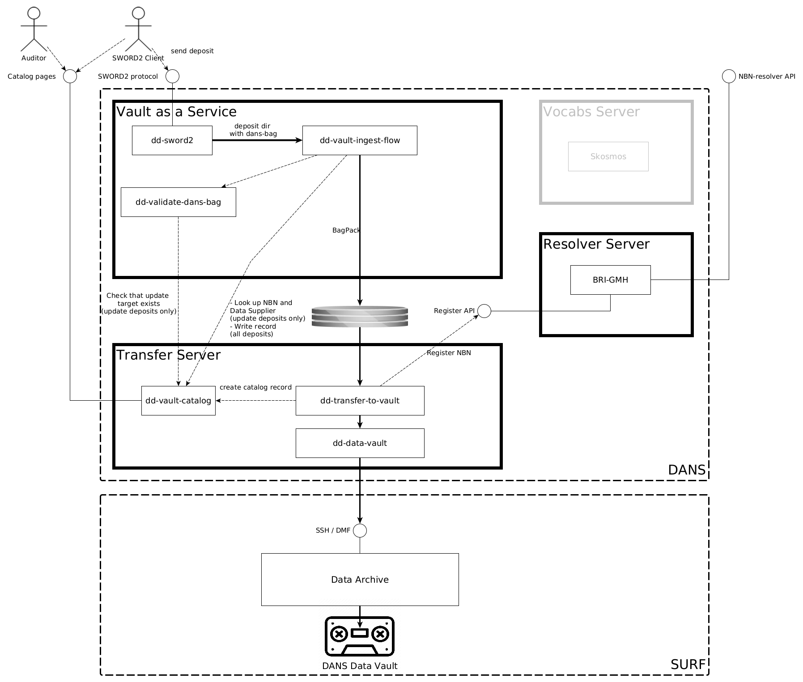

Vault as a Service
==================

Overview
---------

Clients can also use the DANS Data Vault as a building block in their own archival workflows. To this end DANS offers
Vault as a Service. It exposes the same SWORD2 interface as the Data Stations. Instead of storing the datasets in
Dataverse, they are directly converted into RDA compliant bags and transferred to the Data Vault. In this scenario,
dissemination of the datasets remains the responsibility of the customer.

Components
----------

The "Vault as a Service" configuration has mostly the same components as a Data Station. The main difference is that
Dataverse is not part of the configuration. Instead, a new component is introduced to convert the datasets into RDA
compliant bags and transfer them to the Data Vault.

### dd-vault-ingest-flow

Service to convert datasets into RDA compliant bags and transfer them to the Data Vault.

| Docs                                   | Code                                                                |
|----------------------------------------|---------------------------------------------------------------------|
| [dd-vault-ingest-flow]{:target=_blank} | <https://github.com/DANS-KNAW/dd-vault-ingest-flow>{:target=_blank} |

[dd-vault-ingest-flow]: https://dans-knaw.github.io/dd-vault-ingest-flow/

